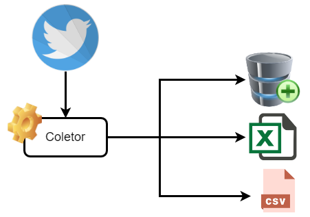

<h1>Coleta de dados no Twitter</h1>

 
<a href = '#description'>Sobre</a> •
<a href = '#tecnologies'>Tecnologias e bibliotecas</a> •
<a href = '#Manual'>Manual</a>

<h2 id = 'description'> Sobre</h2>

Este projeto tem como objetivo criar um coletor de dados simples utilizando a API do Twitter.  Vamos apresentar os principais passos para realizar essa tarefa e, ao final, vamos exportar os dados coletados para um arquivo estruturado do tipo CSV.  

Os dados a serem coletados são:  

• created_at: Data da publicação do tweet  
• name: Contém o nome da usuário que postou o tweet  
• description: Contém a descrição do usuário do tweet  
• location: Localização no qual foi postado o tweet  
• text - Conteúdo postado do tweet  

<h2 id = 'description'> Motivação</h2>

A motivação desse projeto é apresentar de forma prática e simples os passos necessários para realizar uma coleta de dados utilizando a API do Twitter utilizando a linguagem Python.

<h2 id = 'tecnologies'> Tecnologias e bibliotecas </h2>

Linguagem de programação: 
<a href='https://www.python.org'>Python 3.9</a>

Bibliotecas utilizadas:  
1.	<a href='https://www.tweepy.org/'>tweetpy</a> - Biblioteca responsável por acessar os dados da API do Twitter;  
2.	<a href='https://docs.python.org/pt-br/3.7/library/os.html'>os</a> - Responsável por realizar diversas interfaces de sistema operacional;  
3.	<a href='https://pandas.pydata.org/docs/index.html'>pandas</a> - Utilizada para realizar manipulação e análise de dados em dataframes e series;  
4.	<a href='https://pypi.org/project/python-dotenv/'>python-dotenv</a> - Biblioteca utilizada para realizar leitura de chave e valor de um aquivo .env;  

IDE: 

Para esse projeto, optamos utilizar o aplicativo web Jupyter notebook. 

<a href='https://jupyter.org/'>Jupyter Notebook</a>

<h2 id = 'Manual'> Manual</h2>
Foi desenvolvido um manual de auxilio para criação da conta de desenvolvedor no Twitter e eu acredito que será de grande ajuda para você.  

OBS: Pode ser que os passos demonstrados no manual estejam diferentes com o site atual do Twitter. Isso é uma situação já esperada visto que pode ocorrer mudanças ou atualizações. Mas fique tranquilo(a), geralmente os passos seguem um padrão. 

O manual criado pode ser acessado no link abaixo: 
<a href='https://github.com/ProfLeandroLessa/twitter_data_colect/blob/master/manual/cria%C3%A7%C3%A3o_conta_desenvolvedor_Twitter.pdf'>Manual de criação para conta de desenvolvedor do Twitter</a>

